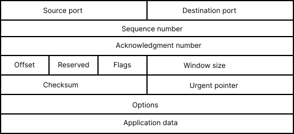
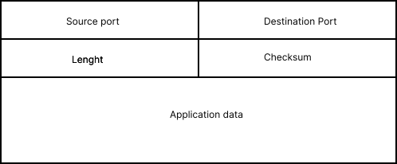

# Transport Layer (L4)

## Overview

The **Transport Layer** is responsible for managing **end-to-end communication between applications**. Depending on the transport protocol being used, it can provide mechanisms such as reliable delivery, error recovery, segmentation, and application identification through port numbers.

Although the **Internet Layer (Layer 3)** is responsible for delivering packets across networks, it does not guarantee that they will arrive without errors, in the correct order, complete, or even reach the correct application.

For this reason, the Transport Layer provides the mechanisms required to ensure that communication between applications is performed correctly.

## Segmentation

One of its responsibilities is **segmentation**. Large amounts of data can be divided into smaller segments before transmission and reassembled by the receiving device once all segments have arrived.

## Application identification (ports)

Another important responsibility is **application identification**. Although the Internet Layer, through IP addressing, can identify the destination host, it cannot determine which application should receive the data. To solve this, the Transport Layer uses **port numbers** to identify applications.

Examples:

- **80** → HTTP
- **443** → HTTPS
- **22** → SSH
- **53** → DNS

## Error detection and recovery

The Transport Layer also provides mechanisms for **error detection and recovery**. Depending on the protocol being used, it can detect lost or corrupted data and retransmit it when necessary.

## Protocol Data Unit (PDU)

The PDU used by the Transport Layer depends on the protocol:

- **TCP:** Segment
- **UDP:** Datagram

## TCP (Transmission Control Protocol)

TCP is a **connection-oriented** transport protocol. It guarantees reliable communication by establishing a connection through a three-step process known as the **Three-Way Handshake** before data transmission begins.

TCP divides information into **segments** and assigns a **sequence number** to each one. This allows the receiving device to reorder segments if they arrive out of order.

It also verifies that every segment is successfully received. If a segment is lost or corrupted during transmission, TCP requests its retransmission.

As a result, TCP guarantees that data is delivered **completely, reliably, and in the same order in which it was sent**.

TCP is commonly used when **data integrity is more important than transmission speed**, such as:

- Web browsing (HTTP/HTTPS)
- File transfers
- Email
- Authentication and login systems
- Transmission of sensitive information such as credentials or personal data

### TCP segment structure

*Figure 2: TCP segment fields*

A quick, surface-level look at what each field does:

- **Source Port / Destination Port** — identify which application on each end is sending and receiving the data
- **Sequence Number** — keeps track of the order of the bytes being sent, so segments can be reassembled correctly
- **Acknowledgment Number** — confirms which data has been received so far
- **Header Length** — indicates how long the header is, since TCP headers can vary in size (due to Options)
- **Flags** — control bits like SYN, ACK, and FIN that manage the connection (starting it, confirming it, closing it)
- **Window Size** — tells the sender how much data the receiver can accept before needing an acknowledgment
- **Checksum** — used to verify the segment wasn't corrupted in transit
- **Options** — optional extra parameters, not present in every segment
- **Data** — the actual payload being transported

## UDP (User Datagram Protocol)

UDP is another Transport Layer protocol, but unlike TCP, it's **connectionless**.

It does not establish a connection before sending data, does not verify whether packets arrive successfully, and does not retransmit lost information.

Like TCP, UDP is responsible for delivering data between applications, but it does so without providing reliability mechanisms.

Because of its lightweight design, UDP introduces much less overhead than TCP, making it significantly faster.

For this reason, UDP is commonly used in applications where **low latency is more important than perfect reliability**, including:

- Video calls
- Online gaming
- Live streaming
- Voice over IP (VoIP)
- DNS queries

### UDP datagram structure

*Figure 3: UDP datagram fields*

Notice how much simpler this is compared to TCP — that's the whole point of UDP:

- **Source Port / Destination Port** — same idea as TCP, identify the sending and receiving application
- **Length** — the total size of the datagram (header + data)
- **Checksum** — verifies the data wasn't corrupted, but there's no mechanism to request a retransmission if it was
- **Data** — the actual payload

That's it — no sequence numbers, no acknowledgments, no flags, no window size. This is exactly why UDP has so little overhead compared to TCP.

## TCP vs UDP — quick recap

| | TCP | UDP |
|---|---|---|
| Connection | Connection-oriented (three-way handshake) | Connectionless |
| Reliability | Guaranteed delivery, retransmits lost data | No delivery guarantee |
| Order | Reorders segments if needed | No ordering |
| Speed | Slower (more overhead) | Faster (less overhead) |
| PDU | Segment | Datagram |
| Common uses | Web, file transfer, email, login | Video calls, gaming, streaming, DNS |

## What would happen without the Transport Layer?

Without the Transport Layer, devices could still exchange packets using IP, but there would be no standardized way to deliver data to the correct application, recover lost information, or provide reliable end-to-end communication between processes.

---

**Next:** [Application layer](tcpip-application-layer.md)